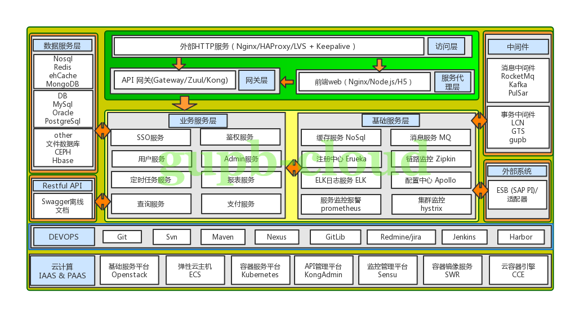

# gupb-cloud  

## 前言  
`gupb-cloud`项目以互联网的技术思想为基础，打造成企业级微服务系统架构。  

## 项目介绍  
`gupb-cloud`项目定位为企业级微服务系统架构，包括基础服务、共通服务、后台管理服务、业务服务、组件化服务。  
架构基于SpringCloud实现。  
基础服务包括：服务注册与发现、配置中心、链路监控、实时应用监控平台、集群监控平台、网关服务、服务监控告警/时序数据监控平台、基础服务监控平台等。  
共通服务包括：MQ服务、ElasticSearch服务、NoSql服务、注解服务、分布式事务服务、多维度数据同步服务、定时任务服务、存储服务等。  
后台管理服务包括：Admin管理服务、Seller管理服务、接口权限控制管理服务、事务日志及数据迁移/同步管理服务、跨域/防渗透安全管理服务。  
业务服务包括：单点登录服务、鉴权服务、用户管理服务、等等。  
组件化服务包括：Feign API服务。  

### 架构图  

#### 总体架构图  
  

#### 数据模型(领域模型)  
完善中。。。

#### 接口模型  
swagger在线/离线接口定义文档  
完善中。。。

## 组织结构

``` lua
gupbcloud-base
  ├── gupbcloud-erueka  服务注册与发现服务
  ├── gupbcloud-config  基于git管理配置中心服务，已被apollo服务取代
  ├── gupbcloud-zipkin  链路监控服务(基于elasticsearch存储)
  ├── gupbcloud-CAT  实时应用监控平台服务
  ├── gupbcloud-hystrix-dashboard  集群监控平台服务
  ├── gupbcloud-zull zull网关服务 基于netfix1.x (webmvc)
  ├── gupbcloud-gateway gateway网关服务 基于springcloud原生 (webflux)
  ├── gupbcloud-apollo 配置中心服务
  ├── gupbcloud-prometheus(Actuator+micrometer+metrics+Grafana) 服务监控告警/时序数据监控平台
gupbcloud-common
  ├── gupbcloud-annotation  注解服务管理
  ├── gupbcloud-core  服务实现
  ├── gupbcloud-mq  MQ服务管理
  ├── gupbcloud-redis  NoSql服务管理
  ├── gupbcloud-rpc  MQ、Feign等加载服务管理
  ├── gupbcloud-requestmapping-rpc  各服务restful api接口收集及接口权限判断
  ├── gupbcloud-common-rpc 整体微服务加载服务管理(actuator prometheus grafana等)
  ├── gupbcloud-util  工具服务管理
gupbcloud-backend
  ├── gupbcloud-admin  admin服务
  ├── gupbcloud-seller  seller服务
  ├── gupbcloud-authority  各端接口权限控制管理服务
  ├── gupbcloud-transactiondata  事务日志及数据迁移/同步管理服务
  ├── gupbcloud-corsssecurity  网络安全管理服务(防CSRF、CORS、XSS组合网络攻击)
gupbcloud-customer
  ├── gupbcloud-sso  单点登录/静默注册、登录服务
  ├── gupbcloud-search  ES查询服务
  ├── gupbcloud-order  订单服务
  ├── gupbcloud-account  账户服务
  ├── gupbcloud-inventory  库存服务
gupbcloud-feign-api
  ├── gupbcloud-customer-sso-api  sso feign
  ├── gupbcloud-customer-search-api  search feign
  ├── gupbcloud-customer-order-api  order feign
  ├── gupbcloud-customer-account-api  account feign
  ├── gupbcloud-customer-inventory-api  inventory feign
  ......
```   
### 技术选型

#### 后端技术

技术 | 说明 | 官网
----|----|----
Spring Cloud | 微服务框架 | [https://spring.io/projects/spring-cloud](https://spring.io/projects/spring-cloud)
Spring Boot | 容器+MVC框架 | [https://spring.io/projects/spring-boot](https://spring.io/projects/spring-boot)
MyBatis | ORM框架  | [http://www.mybatis.org/mybatis-3/zh/index.html](http://www.mybatis.org/mybatis-3/zh/index.html)
MyBatisGenerator | 数据层代码生成 | [http://www.mybatis.org/generator/index.html](http://www.mybatis.org/generator/index.html)
Swagger-UI | 文档生产工具 | [https://github.com/swagger-api/swagger-ui](https://github.com/swagger-api/swagger-ui)
Hibernator-Validator | 验证框架 | [http://hibernate.org/validator/](http://hibernate.org/validator/)
Elasticsearch | 搜索引擎 | [https://github.com/elastic/elasticsearch](https://github.com/elastic/elasticsearch)
RocketMq | 消息队列 | [https://rocketmq.apache.org/](https://rocketmq.apache.org/)
Kafka | 消息队列 | [https://kafka.apache.org/](https://kafka.apache.org/)
Kibana | 数据分析工具 | [https://www.elastic.co/cn/products/kibana](https://www.elastic.co/cn/products/kibana)
Redis | 分布式缓存 | [https://redis.io/](https://redis.io/)
Druid | 数据库连接池 | [https://github.com/alibaba/druid](https://github.com/alibaba/druid)
JWT | JWT登录支持 | [https://github.com/jwtk/jjwt](https://github.com/jwtk/jjwt)
LogStash | 日志收集 | [https://github.com/logstash/logstash-logback-encoder](https://github.com/logstash/logstash-logback-encoder)
Lombok | 简化对象封装工具 | [https://github.com/rzwitserloot/lombok](https://github.com/rzwitserloot/lombok)
Prometheus | 服务监控报警架构 | [https://prometheus.io/docs/introduction/overview/](https://prometheus.io/docs/introduction/overview/)
Grafana | 度量分析与可视化套件 | [https://grafana.com/](https://grafana.com/)  

### 项目启动顺序
首先环境变量相关的内容配置好：JDK1.8、MySql数据库、Redis、RockerMQ、KAFKA、ElasticSearch(业务及监控)。  
启动Erueka、zipkin等监控服务 3、启动gateway或zull 4、启动各业务服务。  
